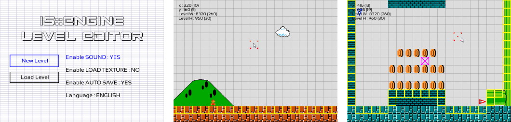

# is::Engine Level Editor
Level editor of the **[Game Engine Demo](https://github.com/Is-Daouda/is-Engine-Demo)**. It was created with the **[is::Engine](https://github.com/Is-Daouda/is-Engine)**. This tool allows you to create your own levels and to be able to integrate it into the game engine Level-Editor. You can also adapt it to use it for your own game.

**Please consult the [user guide](./doc/) to learn how to use the Level editor.**



## Prerequisites
- [SFML Library (2.4 +)](https://www.sfml-dev.org/download.php)
- GCC Compiler (7.3 +)

---

## How to use is::Engine with the different development tools:
##  CMake
**1. Prerequisites**
- CMake (3.1 +)

**2. Installation**
#### Windows
1. Compile SFML with CMake to have **static libraries** and put on **C:/ (C:/SFML)**.
2. Move the **is-Engine-Level-Editor** project to your **C:/ (C:/is-Engine-Level-Editor)**.
3. Execute this command :
```bash
cmake -S "C:/is-Engine-Level-Editor" -B "C:/build"
cd build
make
```

#### Linux
1. Install SFML 2.5.1 on your machine.
2. Move the **is-Engine-Level-Editor** project to **/home/user/ (/home/user/is-Engine-Level-Editor)**.
3. Execute this command :
```bash
sudo cmake -S "is-Engine-Level-Editor" -B "build"
cd build
sudo make
```

**3. After installation**
- You will have a **bin** folder in which the engine Level-Editor is located.

**5. Adding Source Files**
- In order for CMake to detect your source files (.cpp) you must include them in the **[app_src.cmake](./app/src/main/cmake/app_src.cmake) or [isengine.cmake](./app/src/main/cmake/isengine.cmake)** file which is located in the **[is-Engine-Level-Editor/app/src/main/cmake](./app/src/main/cmake/)** location.

---

##  Qt

**1. Installation**
#### Windows
1. Download Qt 5.12.9 MinGW [here](http://qtproject.mirror.liquidtelecom.com/archive/qt/5.12/5.12.9/qt-opensource-windows-x86-5.12.9.exe) and install it.
2. Download this [version of SFML](https://github.com/Is-Daouda/SFML_Qt_MinGW) already compiled for Qt 5.12.9 and extract it in **C:/ (C:/SFML_Qt_MinGW)**.

**2. Opening the project with the IDE:**

#### Windows
1. Run the file **open_qt_creator.bat** in the main directory *(Make sure you have included the path to the Qt executable in your PATH environment variable)*.
2. Or open the file **is-Engine.pro** in the location **[is-Engine-Level-Editor/app/src/main/qt](./app/src/main/qt/)**

**3. Executable location**
- The compiler files can be found in **is-Engine-Level-Editor/app/src/main/bin-Qt**.

---

##  Visual Studio Code
This project uses the template of **andrew-r-king**. For more information on this template [click here](https://github.com/andrew-r-king/sfml-vscode-boilerplate).

**1. Prerequisites**
#### Windows
- [SFML 2.5.1 - GCC 7.3.0 MinGW (DW2) 32-bit](https://www.sfml-dev.org/files/SFML-2.5.1-windows-gcc-7.3.0-mingw-32-bit.zip)
- [GCC 7.3.0 MinGW (DW2) 32-bit](https://sourceforge.net/projects/mingw-w64/files/Toolchains%20targetting%20Win32/Personal%20Builds/mingw-builds/7.3.0/threads-posix/dwarf/i686-7.3.0-release-posix-dwarf-rt_v5-rev0.7z/download)
- [Git Bash](https://git-scm.com/downloads)

#### Linux
- Get SFML 2.5.1 from your distro if it has it, or compile from source.

**2. Installation**
#### Windows
1. Download & Extract SFML 2.5.1 to **C:/SFML/** where the bin/lib/include folders are contained within.
2. Download & Extract MinGW to **C:/mingw32/** where the bin/lib/include folders are contained within.

#### Linux
1. Ensure the GCC Toolchain is installed (**sudo apt install build-essential**).
2. Run **sudo apt install libsfml-dev**. The SFML version you got will vary depending on the distro. 2.5.1 is included in [Ubuntu 19.04 Disco Dingo](http://cdimage.ubuntu.com/daily-live/current/HEADER.html) for example.

**3. Opening the project with the IDE:**
#### Windows
1. Run the file **open_vscode.bat** in the main directory.

#### Linux
2. Execute this command in the main directory:
```bash
code -n "./app/src/main"
```

#### All
3. Or open the **[is-Engine-Level-Editor/app/src/main](./app/src/main/)** folder with **Solution Explorer**.

**4. Executable location**
- The compiler files can be found in **is-Engine-Level-Editor/app/src/main/bin-vscode**.

---

##  Code::Blocks

**1. Installation**
#### Windows
1. Download Code::Blocks 20.03 MinGW [here](https://sourceforge.net/projects/codeblocks/files/Binaries/20.03/Windows/codeblocks-20.03mingw-setup.exe/download) and install it.
2. Download this [version of SFML](https://github.com/Is-Daouda/SFML_CB_MinGW) already compiled for Code::Blocks 20.03 and extract it in **C:/ (C:/SFML_CB_MinGW)**.

#### Linux
1. Download Code::Blocks 20.03 and install it.
2. Ensure the GCC Toolchain is installed (**sudo apt install build-essential**).
3. Run **sudo apt install libsfml-dev**. The SFML version you got will vary depending on the distro. 2.5.1 is included in [Ubuntu 19.04 Disco Dingo](http://cdimage.ubuntu.com/daily-live/current/HEADER.html) for example.

**2. Opening the project with the IDE:**

#### Windows
1. Run the file **open_codeblocks.bat** in the main directory *(Make sure you have included the path to the Code::Blocks executable in your PATH environment variable)*.
2. Or open the file **is-Engine-windows.cbp** in the location **[is-Engine-Level-Editor/app/src/main](./app/src/main/)**

#### Linux
1. Execute this command in the main directory:
```bash
codeblocks "./app/src/main/is-Engine-linux.cbp"
```
2. Or open the file **is-Engine-linux.cbp** in the location **[is-Engine-Level-Editor/app/src/main](./app/src/main/)**.

**3. Executable location**
- The compiler files can be found in **is-Engine-Level-Editor/app/src/main/bin-codeblocks**.

---

##  Develop SFML games with SDL 2

**1. Installation**
#### Windows
1. Download Code::Blocks 20.03 MinGW [here](https://sourceforge.net/projects/codeblocks/files/Binaries/20.03/Windows/codeblocks-20.03mingw-setup.exe/download) and install it.
2. Download this [version of SDL 2](https://github.com/Is-Daouda/SDL2) and extract it in **C:/ (C:/SDL2)**.
3. Put the **.dll files** which is in the **bin** folder of SDL2 in the **[main](./app/src/main/)** folder.

**2. Opening the project with the IDE:**
1. Run the file **open_codeblocks_sdl.bat** in the main directory *(Make sure you have included the path to the Code::Blocks executable in your PATH environment variable)*.
2. Or open the file **is-Engine-windows-SDL2.cbp** in the location **[is-Engine-Level-Editor/app/src/main](./app/src/main/)**

**3. Executable location**
- The compiler files can be found in **is-Engine-Level-Editor/app/src/main/bin-codeblocks**.

##  Very important
- If you want to use SDL functions in your source code, use the **IS_ENGINE_SDL_2 macro**.
- Note that some SFML functions like: **Vertex Array, Render Texture** are not yet supported. These additions will be made soon!

---

##  Change application icon:
#### Windows
- To change the icon of the application you must go to the location **[is-Engine-Level-Editor/app/src/main/env/windows](./app/src/main/env/windows)** replace all the images **(Attention CMake uses the same resources).**

#### Linux
- To change the icon of the application you must go to the location **[is-Engine-Level-Editor/app/src/main/env/linux](./app/src/main/env/linux)**.

---

## Description of the project structure:

----------------------------
- The source files of the project can be found in the **[is-Engine-Level-Editor/app/src/main/cpp](./app/src/main/cpp/)** location.

#### 1. [main.cpp](./app/src/main/cpp/main.cpp) file
Contains the entry point of the program, inside there are two instructions :
- `game.play()`: Launches the engine rendering loop which allows to manage the introduction screen, main menu, level and game over.
- `game.basicSFMLmain()` (disabled by default): Launches the display of a classic SFML window. The implementation is in the **[basicSFMLmain.cpp](./app/src/main/cpp/basicSFMLmain.cpp)** file. *Very useful if you already have a project under development and you want to associate it with the engine. You can also use it to implement your own components to the engine.*

----------------------------
#### 2. [app_src](./app/src/main/cpp/app_src/) folder
Contains the source code of the game.
Description of these sub-directories:
- **[activity](./app/src/main/cpp/app_src/activity/)** : Contains the **[Activity](./app/src/main/cpp/app_src/activity/GameActivity.h)** class which allows the interaction of the different scenes of the game.
- **[config](./app/src/main/cpp/app_src/config/)** : Contains the **[GameConfig.h](./app/src/main/cpp/app_src/config/GameConfig.h)** file which allows to define the general parameters of the game. It also contains the file **[ExtraConfig.h](./app/src/main/cpp/app_src/config/ExtraConfig.h)** which allows to activate / deactivate certain engine functionality (Engine optimization, SDM, Admob, Main Render Loop, ...).
- **[gamesystem_ext](./app/src/main/cpp/app_src/gamesystem_ext/)** : Contains **[GameSystemExtended](./app/src/main/cpp/app_src/gamesystem_ext/GameSystemExtended.h)** a class derived from **[GameSystem](./app/src/main/cpp/isEngine/system/function/GameSystem.h)** which allows to manipulate game data (save, load, ...).
- **[language](./app/src/main/cpp/app_src/language/)** : Contains the **[GameLanguage.h](./app/src/main/cpp/app_src/language/GameLanguage.h)** file which allows to manage everything related to game languages.
- **[levels](./app/src/main/cpp/app_src/levels/)** : Contains game levels and the **[Level.h](./app/src/main/cpp/app_src/levels/Level.h)** file which allows to integrate them into the game.
- **[objects](./app/src/main/cpp/app_src/objects/)** : Contains the objects that will be used in the different scenes.
- **[scenes](./app/src/main/cpp/app_src/scenes/)** : Contains the different scenes of the game (Introduction, Main menu, ...).

----------------------------
#### 3. [assets](./app/src/main/assets/) folder
Contains game resource files (music, sound sfx, image, ...)

----------------------------
#### 4. [isEngine](./app/src/main/cpp/isEngine/) folder
Contains the source code of the game engine

---

## Special things to know about the engine
### is::LibConnect
With the is::LibConnect you can write code for a specific library. Here is how to do it:
```cpp
sf::Text text;
text.setString(
// on PC (Windows / Linux)
#if define(IS_ENGINE_SFML)    
    "We use SFML 2 library"

// on Android or when you use SDL to create SFML games on PC (only for Code::Block at the moment)    
#elif define(IS_ENGINE_SDL_2)
    "Run SFML 2 with SDL 2"

// When we develop for the web (HTML 5) with Emscripten    
#elif define(IS_ENGINE_HTML_5)
    "SFML 2 on Web"
#endif
              );
```

#### If you have discovered another way to use the game engine, don't hesitate to share it! We will put it in this Special section so that other people can benefit from it!

---

## How to update an is::Engine project
1. First of all the part of is::Engine that changes most often during updates is the [isEngine](./app/src/main/cpp/isEngine/) folder. But it also happens that these files can be modified:
- [GameActivity.h](./app/src/main/cpp/app_src/activity/GameActivity.h)
- [GameConfig.h](./app/src/main/cpp/app_src/language/GameLanguage.h)
- [ExtraConfig.h](./app/src/main/cpp/app_src/config/ExtraConfig.h)
- [GameSystemExtended.h](./app/src/main/cpp/app_src/gamesystem_ext/GameSystemExtended.h)
- [basicSFMLmain.cpp](./app/src/main/cpp/basicSFMLmain.cpp)
- [GameLanguage.h](./app/src/main/cpp/app_src/language/GameLanguage.h)
- And the files which is in [cmake](./app/src/main/cmake) and [web](./app/src/main/web) folder.
-  **So watch them carefully in case you encounter any errors during migration!**
2. To update your old project with a new version of is::Engine: the files (.h and .cpp) you need to move are in [objects](./app/src/main/cpp/app_src/objects/) and [scenes](./app/src/main/cpp/app_src/scenes/). **Note that these folders never change whatever the version!**

---

## Contribute
- If you want to participate in the development of the project to help me improve the engine, please note that you are welcome! Together we go further!
- One of the objectives of this project is to create a large community that can work on the engine to allow many people around the world to easily realize their dream games / applications!

## Contacts
  * For any help please contact me on my [email address](mailto:isdaouda.n@gmail.com)
  * You can follow me on Twitter for more informations on my activities [@Is Daouda Games](https://twitter.com/IsDaouda_Games)